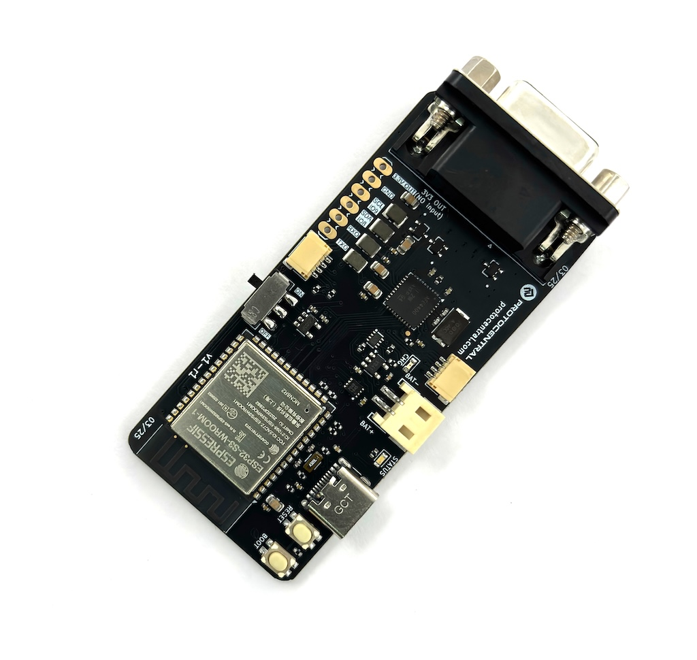
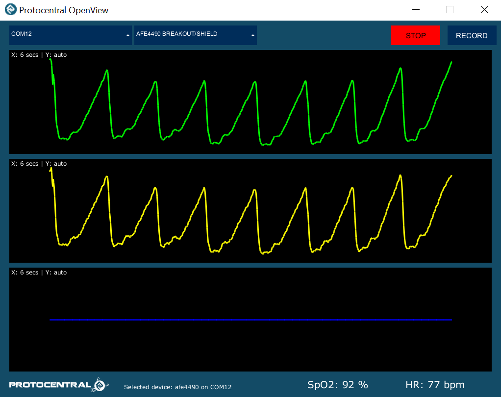
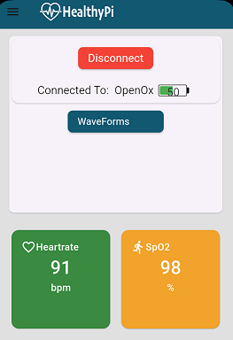
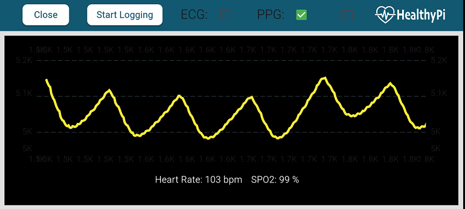

Protocentral Sensything Ox Wireless Pulse Sensor Kit based on AFE4400/ESP32S3
========================================

## Don't have one? [Buy it here](https://protocentral.com/product/protocentral-sensythingox-wireless-pulse-sensor-kit-based-on-afe4400-esp32/)

Protocentral Sensything Ox is the latest, renamed version of our popular [OpenOx](https://github.com/Protocentral/protocentral_openox) Pulse sensor board. It is a standalone, wireless pulse oximetry breakout board that is powered by the ESP32S3 module and uses the AFE4400 IC to measure oxygen levels in the blood while also providing a PPG waveform, heart rate, and SpO2 values measured with high precision.

The Senysthing Ox improves upon the previous version of the [OpenOx board](https://github.com/Protocentral/protocentral_openox) by replacing the ESP32 module with ESP32S3 with 8MB Flash memory and 2MB PSRAM. This allows for a more powerful and efficient processing of the data collected by the AFE4400 IC. The board is designed to be used in a variety of applications, including medical research, fitness tracking, and remote patient monitoring.

## Hardware Setup

The Sensything Ox programs are all in Arduino and examples are in the examples folder of this repo. To program, select the "ESP32S3 Dev Module" board in the Arduino IDE with the following settings.

* Board: ESP32S3 Dev Module
* USB Mode: Hardware CDC and JTAG
* USB CDC on Boot: Enabled
* Upload Mode: UART0 / Hardware CDC
* PSRAM: QSPI PSRAM

# Documentation

For further details of the board, refer the documentation at the following links:

[Protocentral Sensything Ox Wireless Pulse Sensor Documentation](https://docs.protocentral.com/getting-started-with-openox/)

# Visualizing Output

### USB Streaming

* Open the GUI, make sure to select **AFE4490 breakout** under the **Board** dropdown and the appropriate **Port**. If everything goes well, you will be able to see the screen as pictured above.

   

  

  

### BLE streaming

 

  

  

 

  

  

License Information
===================

This product is open source! Both, our hardware and software are open source and licensed under the following licenses:

Hardware
---------

**All hardware is released under the [CERN-OHL-P v2](https://ohwr.org/cern_ohl_p_v2.txt)** license.

Copyright CERN 2020.

This source describes Open Hardware and is licensed under the CERN-OHL-P v2.

You may redistribute and modify this documentation and make products
using it under the terms of the CERN-OHL-P v2 (https:/cern.ch/cern-ohl).
This documentation is distributed WITHOUT ANY EXPRESS OR IMPLIED
WARRANTY, INCLUDING OF MERCHANTABILITY, SATISFACTORY QUALITY
AND FITNESS FOR A PARTICULAR PURPOSE. Please see the CERN-OHL-P v2
for applicable conditions

Software
--------

**All software is released under the MIT License(http://opensource.org/licenses/MIT).**

THE SOFTWARE IS PROVIDED "AS IS", WITHOUT WARRANTY OF ANY KIND, EXPRESS OR IMPLIED, INCLUDING BUT NOT LIMITED TO THE WARRANTIES OF MERCHANTABILITY, FITNESS FOR A PARTICULAR PURPOSE AND NONINFRINGEMENT. IN NO EVENT SHALL THE AUTHORS OR COPYRIGHT HOLDERS BE LIABLE FOR ANY CLAIM, DAMAGES OR OTHER LIABILITY, WHETHER IN AN ACTION OF CONTRACT, TORT OR OTHERWISE, ARISING FROM, OUT OF OR IN CONNECTION WITH THE SOFTWARE OR THE USE OR OTHER DEALINGS IN THE SOFTWARE.

Documentation
-------------
**All documentation is released under [Creative Commons Share-alike 4.0 International](http://creativecommons.org/licenses/by-sa/4.0/).**

You are free to:

* Share — copy and redistribute the material in any medium or format
* Adapt — remix, transform, and build upon the material for any purpose, even commercially.
The licensor cannot revoke these freedoms as long as you follow the license terms.

Under the following terms:

* Attribution — You must give appropriate credit, provide a link to the license, and indicate if changes were made. You may do so in any reasonable manner, but not in any way that suggests the licensor endorses you or your use.
* ShareAlike — If you remix, transform, or build upon the material, you must distribute your contributions under the same license as the original.

Please check [*LICENSE.md*](LICENSE.md) for detailed license descriptions.
